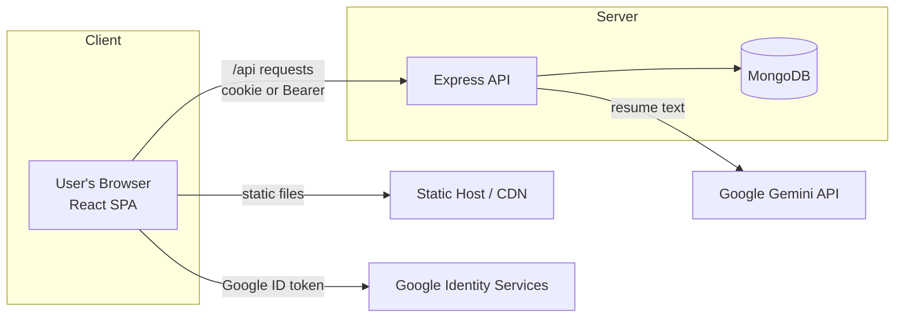
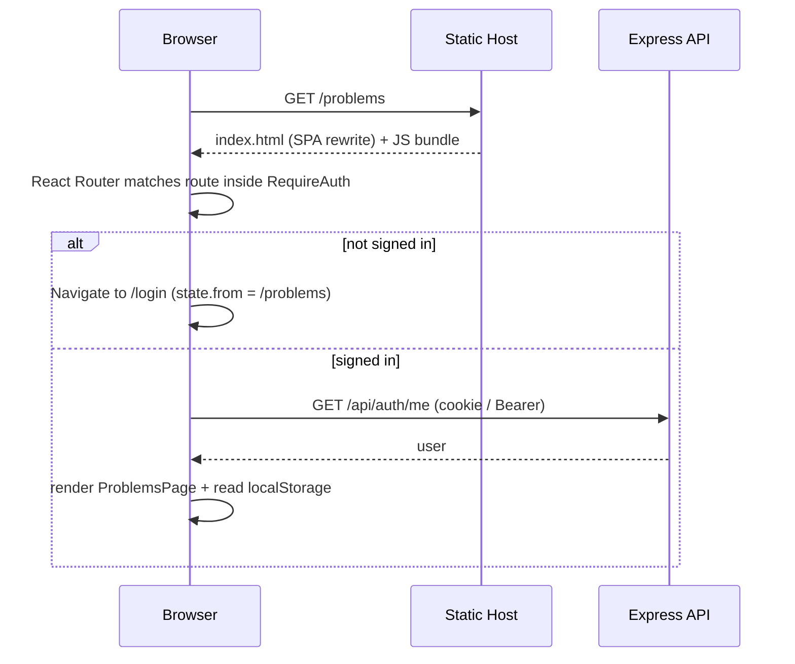
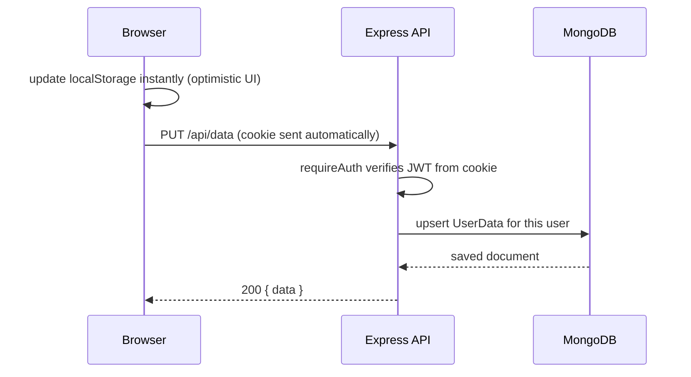
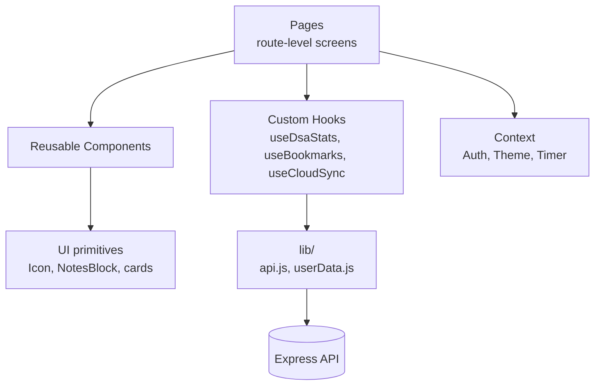

# 01 · Architecture

> How all the pieces fit together, in plain words + interview-level detail.

---

## 1. The 30-second mental model

MyDSA has **three moving parts**:

1. **The browser (React SPA)** — everything you see. Progress still uses `localStorage` for
   instant UX once you are signed in; unsigned users only see marketing + auth pages.
2. **The API (Node + Express)** — REST server for login, Google verify, and saving user data.
3. **The database (MongoDB)** — durable store so progress survives across devices.

**In simple words:** the site is a learning platform behind a login. The homepage is public;
problems, engineering tracks, and notes require an account. The server is the source of truth
for identity and synced progress.

---

## 2. Why this architecture? (interview answer)

> "I chose a **decoupled SPA + REST API**. The front end is a static bundle on a CDN; the API is
> stateless (JWT) so it scales without sticky sessions. Content is **auth-gated** on both the
> client (`RequireAuth`) and the server (`requireAuth`). Progress uses a two-tier store:
> **localStorage** for instant UX after login, and **MongoDB** as the durable sync target."

**Key properties:**
- **Auth-gated learning** — public marketing/auth pages; everything else requires a session.
- **Stateless API** — horizontally scalable (no server memory of sessions).
- **Offline-tolerant progress** — once signed in, local writes stay fast; sync catches up.

---

## 3. Request lifecycle (what happens on a click)

### 3a. Loading a protected page (e.g. `/problems`)

Because it's an SPA, the host must **rewrite** unknown paths to `index.html` (see
[doc 09](./09-deployment-and-env.md)). React Router then renders the page; `RequireAuth` decides
whether to show it or send the user to login.

### 3b. A logged-in action (e.g. mark a problem solved)

**Interview point — optimistic UI:** we update the screen *first*, then sync in the background
(debounced). The user never waits on the network. If the request fails, the next sync retries.

---

## 4. Layers of the front end

- **Pages** = screens tied to a route (`/dashboard`, `/system-design`, …).
- **Components** = reusable building blocks (Navbar, cards, tables).
- **Hooks** = the *logic* (reading stats, syncing) kept separate from the *view*.
- **Context** = truly global state (who's logged in, current theme).
- **lib/** = plumbing (the `fetch` wrapper, the merge algorithm).

**Why separate hooks from components? (interview)**
> "Keeping business logic in hooks makes components dumb and reusable, makes the logic unit-testable
> in isolation, and avoids duplicating the same `localStorage` reads across pages."

---

## 5. Performance decisions

| Technique | What it does | Where |
|-----------|--------------|-------|
| **Code splitting** (`React.lazy`) | Secondary pages load on demand → smaller initial bundle | `App.jsx` |
| **Route-based chunks** | Heavy pages (Puzzles, PDF) are separate JS files | build output |
| **Debounced sync** | Batches writes so we don't spam the API | `useCloudSync` |
| **Optimistic UI** | Instant feedback, network in background | progress hooks |
| **CDN-friendly static build** | Cacheable assets, fast global loads | Vite build |
| **Lazy PDF parsing** | `pdfjs-dist` imported only when needed | `lib/pdf.js` |

**Core Web Vitals framing:** code-splitting improves **LCP** (less JS to parse up front),
reserved skeleton heights prevent **CLS** (layout shift), and debouncing keeps the main thread free
for good **INP** (interaction responsiveness).

---

## 6. Where to look in the code

| To understand… | Read… |
|----------------|-------|
| App routes & lazy loading | `src/App.jsx` |
| API setup (CORS, cookies, rate limit) | `server/src/index.js` |
| Auth endpoints | `server/src/routes/auth.js` |
| Data sync endpoints | `server/src/routes/data.js` |
| The sync engine | `src/hooks/useCloudSync.js`, `src/lib/userData.js` |
| JWT & cookie config | `server/src/utils/token.js` |

Continue to **[02-authentication-and-authorization.md »](./02-authentication-and-authorization.md)**
