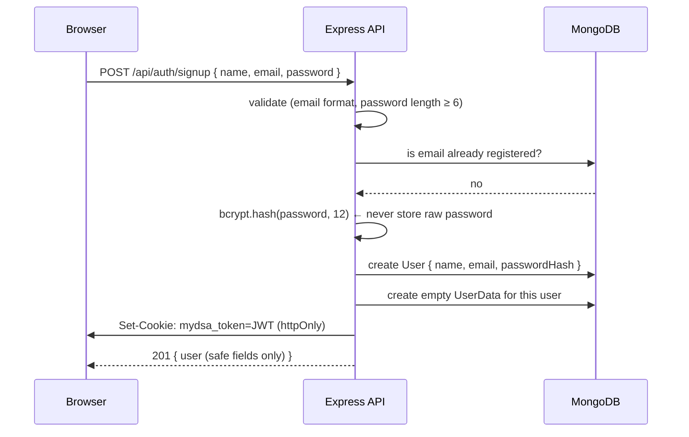
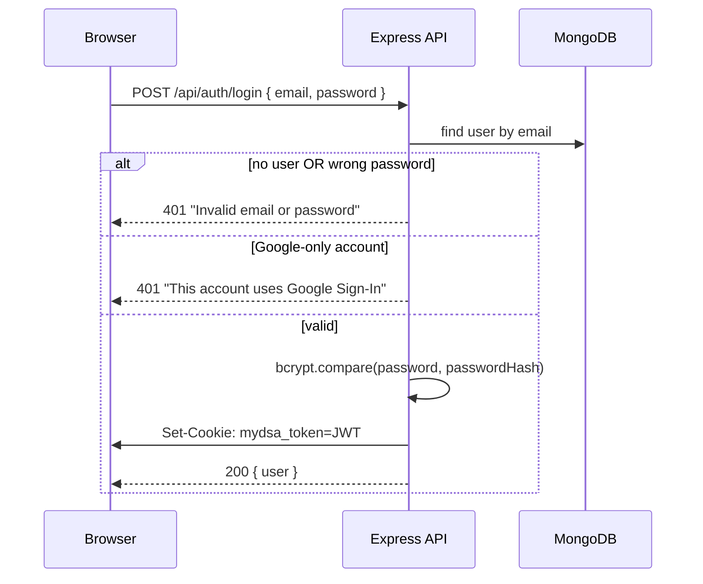
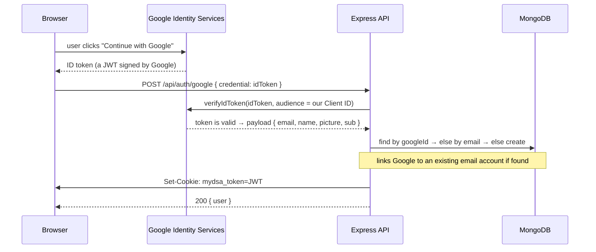
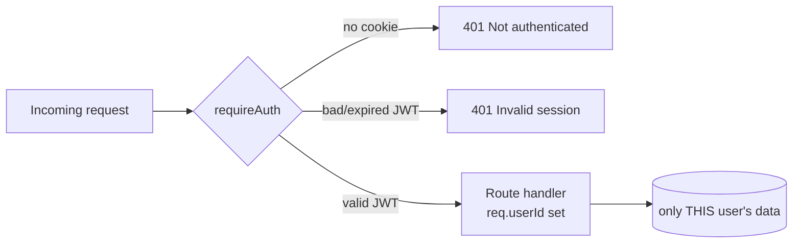

# 02 · Authentication & Authorization

> **Authentication (authN)** = *Who are you?*
> **Authorization (authZ)** = *What are you allowed to do?*
>
> Easy analogy: authentication is showing your ID card at the door; authorization is the door
> only letting you into the rooms your card permits.

---

## 1. What MyDSA supports

- **Email + password** signup / login.
- **Google Sign-In** ("Continue with Google") — one click, with profile picture.
- **Account linking** — sign up with email, later use Google with the *same* email → one account.
- **Stateless sessions** via a **JWT** stored in an **httpOnly cookie** (details in [doc 03](./03-cookies-and-sessions.md)).

---

## 2. Email/password signup — step by step



**Why hash passwords? (interview)**
> "We never store the actual password. `bcrypt` runs a one-way hash with a **salt** and a **work
> factor** (we use 12 rounds). Even if the database leaks, attackers can't reverse the hashes, and
> the salt stops precomputed 'rainbow table' attacks. bcrypt is deliberately *slow* to make brute
> force expensive."

**Key code:** `server/src/routes/auth.js` → `bcrypt.hash(password, 12)`.

---

## 3. Login



**Security detail:** we return the **same** "Invalid email or password" message whether the email
doesn't exist or the password is wrong. This avoids **user enumeration** (leaking which emails are
registered).

---

## 4. Google Sign-In (OAuth / OpenID Connect)

**In simple words:** Google proves who you are and hands the browser a signed **ID token**. Our
server checks Google's signature, and if it's valid, logs you in.



**Why verify the token on the server? (interview)**
> "The browser is untrusted — anyone can POST a fake token. The server calls
> `OAuth2Client.verifyIdToken`, which checks Google's cryptographic signature, the **audience**
> (must equal *our* Client ID, so a token minted for another app is rejected), the issuer, and
> expiry. Only then do we trust the email inside."

**Account-linking logic** (`routes/auth.js` → `/google`):
1. Look up by `googleId`. Found → sign in.
2. Else look up by `email`. Found → **link** Google to that account (set `googleId`, refresh avatar).
3. Else → **create** a new Google-provider user (no password).

**Client ID note:** the frontend (`VITE_GOOGLE_CLIENT_ID`) and backend (`GOOGLE_CLIENT_ID`) must be
the **same** OAuth Web Client ID — the server uses it as the "audience" to verify tokens.

---

## 5. Authorization — protecting routes

Authorization here is simple and **middleware-based**. Any route that needs a logged-in user is
wrapped with `requireAuth`.



```js
// server/src/middleware/auth.js  (the whole idea in a few lines)
export function requireAuth(req, res, next) {
  const token = req.cookies?.[COOKIE_NAME];
  if (!token) return res.status(401).json({ error: 'Not authenticated' });
  try {
    const { uid } = verifyToken(token);   // verify JWT signature + expiry
    req.userId = uid;                     // hand the user id to the handler
    next();
  } catch {
    return res.status(401).json({ error: 'Invalid or expired session' });
  }
}
```

**Ownership scoping (important authZ point):** every data query is filtered by `req.userId`
(e.g. `UserData.findOne({ user: req.userId })`). A user can therefore **only ever read/write their
own document** — there's no way to pass someone else's id and read their data. This prevents
**IDOR** (Insecure Direct Object Reference) bugs.

**AuthN vs AuthZ in one line (interview):**
> "`verifyToken` answers *who you are* (authentication). Filtering every query by that verified
> `userId` enforces *what you can touch* (authorization)."

---

## 5b. Frontend route protection (`RequireAuth`)

Backend auth alone is not enough for UX — without a client guard, guests could open `/engineering`
and see a broken or empty shell. MyDSA wraps every learning route in `RequireAuth`:

```js
// Public: /, /login, /signup
// Protected: everything else (problems, engineering, notes, …)
if (status === 'loading') return <Spinner />;
if (!isAuthed) return <Navigate to="/login" state={{ from: location }} replace />;
return children;
```

After login, `AuthForm` reads `location.state.from` and sends the user back to the page they wanted.

**Why both client + server checks? (interview)**
> "The React guard is for **UX** (no content flash, clear login redirect). The Express
> `requireAuth` middleware is for **security** — anyone can call `/api/data` with curl, so the
> API must never trust the UI alone."

**Session restore on reload:** `GET /api/auth/me` runs on app boot. Cookie and/or Bearer token
prove the session. Network blips with a stored token keep a cached user so a cold API doesn’t
look like a logout (see [doc 07](./07-problems-and-decisions.md)).

---

## 6. Other protections in place

| Threat | Mitigation | Where |
|--------|------------|-------|
| Password theft from DB leak | bcrypt hash + salt, 12 rounds | `auth.js` |
| Token theft via XSS | `httpOnly` cookie (JS can't read it) | `token.js` |
| Brute-force login | Rate limit: 100 auth requests / 15 min / IP | `index.js` |
| Fake Google tokens | Server-side `verifyIdToken` with audience check | `auth.js` |
| Leaking password hash in responses | `toSafeJSON()` returns only safe fields | `models/User.js` |
| User enumeration | Identical error for wrong email vs wrong password | `auth.js` |
| Abusive AI endpoint use | Tighter rate limit: 20 / 15 min | `index.js` |

---

## 7. Likely interview questions (with crisp answers)

**Q: Sessions vs JWT — why did you pick JWT?**
> Server-side sessions store state in memory/DB and need a lookup on every request (and sticky
> sessions or shared storage when scaled). A JWT is **self-contained and signed**, so any API
> instance can verify it without a shared store — great for a stateless, horizontally-scalable API.

**Q: Downside of JWT, and how do you handle logout?**
> JWTs can't be individually revoked before expiry (they're stateless). We keep expiry at 30 days
> and **logout clears the cookie**. For instant revocation you'd add a server-side blocklist or
> short-lived access tokens + refresh tokens — a documented trade-off.

**Q: Why store the JWT in a cookie instead of localStorage?**
> `localStorage` is readable by any JS, so an XSS bug could steal the token. An **httpOnly** cookie
> is invisible to JS. The trade-off is CSRF risk, which we limit with `SameSite` (see [doc 03](./03-cookies-and-sessions.md)).

**Q: What's in your JWT payload?**
> Just the user id (`uid`) and standard claims (issued-at, expiry). No sensitive data — anyone can
> *decode* a JWT; only the server can *verify* it with the secret. So we never put secrets inside.

**Q: How does Google Sign-In actually trust work?**
> Google signs an ID token with its private key. Our server verifies it against Google's public
> keys and checks the audience equals our Client ID. Trust flows from Google's signature, not from
> the browser.

**Q: Why lock content behind login instead of anonymous localStorage-only?**
> Product decision: the Engineering library and curated material should require an account so
> progress is attributable and syncable. Anonymous browsing is limited to the marketing home page;
> learning routes use `RequireAuth`, and the API still enforces JWT on data endpoints.

Continue to **[03-cookies-and-sessions.md »](./03-cookies-and-sessions.md)**
