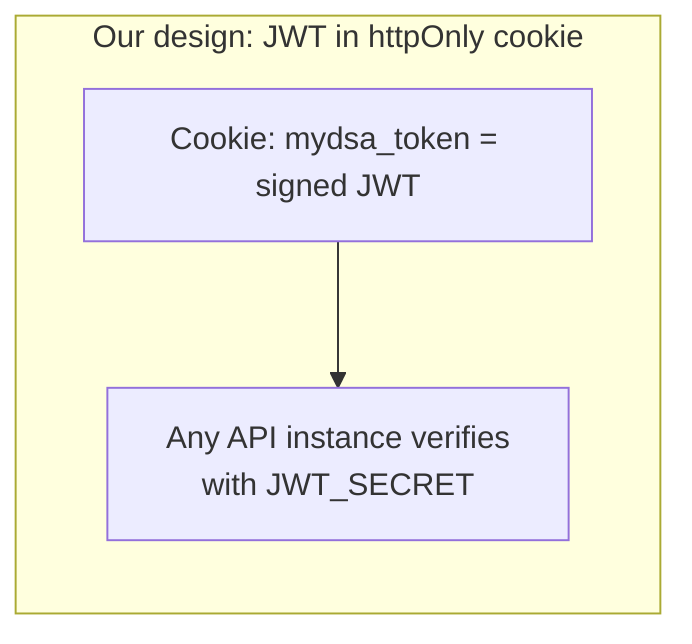
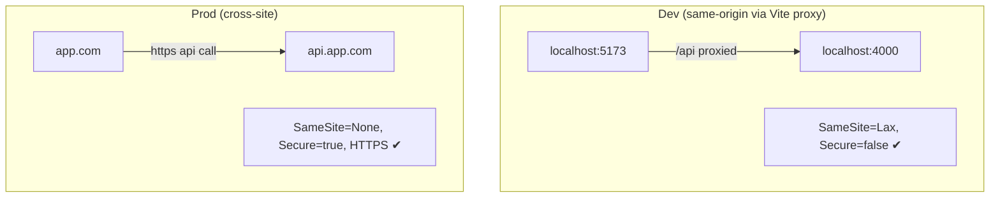
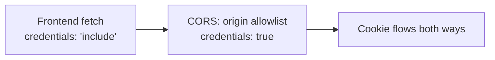

# 03 · Cookies & Sessions

> This is one of the most-asked interview areas. We go from "what is a cookie" all the way to the
> exact configuration MyDSA uses and *why*.

---

## 1. The basics, in plain words

- **HTTP is stateless** — each request is independent; the server forgets you the moment it responds.
- A **cookie** is a small piece of data the server asks the browser to store. The browser then
  **automatically attaches it to every future request** to that site. That's how the server
  "remembers" you.
- A **session** is the *concept* of "you are logged in for a while." A cookie is the *mechanism*
  that carries the proof of that session.

```mermaid
sequenceDiagram
    participant B as Browser
    participant S as Server
    B->>S: POST /login (correct credentials)
    S-->>B: 200 + Set-Cookie: mydsa_token=JWT; HttpOnly; ...
    Note over B: browser stores the cookie
    B->>S: GET /api/data  (Cookie: mydsa_token=JWT sent automatically)
    S->>S: verify JWT → know who you are
    S-->>B: 200 your data
```

---

## 2. Two ways to do sessions (and which we chose)

| Approach | Where state lives | Pros | Cons |
|----------|-------------------|------|------|
| **Server-side session** | Server memory / Redis / DB; cookie holds only a session **id** | Easy to revoke; small cookie | Needs shared storage when scaled; lookup per request |
| **Stateless JWT (our choice)** | Inside the token itself, signed | No server storage; any instance can verify; scales flat | Hard to revoke before expiry; token slightly bigger |

**MyDSA uses the stateless JWT-in-cookie approach** — we get the security of an httpOnly cookie
*and* the scalability of stateless tokens.



---

## 3. Anatomy of our cookie (line by line)

From `server/src/utils/token.js`:

```js
export const cookieOptions = {
  httpOnly: true,                       // JS cannot read it  → protects against XSS token theft
  secure: isProd,                       // HTTPS-only in production
  sameSite: isProd ? 'none' : 'lax',    // cross-site in prod, same-site in dev
  maxAge: 30 * 24 * 60 * 60 * 1000,     // 30 days
  path: '/',                            // sent for the whole site
};
export const COOKIE_NAME = 'mydsa_token';
```

### What each attribute means (interview gold)

| Attribute | Simple meaning | Why it matters |
|-----------|----------------|----------------|
| **HttpOnly** | JavaScript can't read the cookie | If an attacker injects JS (XSS), they still can't steal the token |
| **Secure** | Only sent over HTTPS | Stops the token being sniffed on plain HTTP |
| **SameSite** | Controls sending on cross-site requests | The main defense against **CSRF** |
| **Max-Age / Expires** | How long it lives | Our session lasts 30 days |
| **Path** | Which URLs get the cookie | `/` = the whole app |
| **Domain** | Which host(s) get it | Defaults to the API host |

### SameSite values explained

- `Strict` — cookie **never** sent on cross-site requests (safest, but breaks some navigations).
- `Lax` — sent on top-level GET navigations, not on cross-site POST/fetch (good default).
- `None` — sent on **all** cross-site requests; **requires `Secure`**.

---

## 4. Why our SameSite/Secure values flip between dev and prod

This is the subtle part interviewers love.

**Development:** the React app (`localhost:5173`) talks to the API through **Vite's proxy**
(`/api` → `localhost:4000`). From the browser's point of view the request is **same-origin**, so:
- `sameSite: 'lax'` works fine, and
- `secure: false` is fine because dev is plain `http`.

**Production:** the static front end and the API are typically on **different hosts**
(e.g. `app.com` and `api.app.com`). Now the cookie is **cross-site**, so it must be:
- `sameSite: 'none'` (or the browser won't send it), which in turn **requires**
- `secure: true` (HTTPS).



**Two must-do production settings** (documented in `.env.example`):
1. Backend `CLIENT_ORIGIN` = the exact frontend URL (credentialed CORS can't use `*`).
2. Frontend `VITE_API_URL` = the deployed API URL, both over **HTTPS**.

---

## 5. CORS + credentials (why both sides must agree)

For the browser to **send** the cookie cross-site AND let JS read the response, three things must
line up:



- **Frontend** (`src/lib/api.js`): `credentials: 'include'` on every `fetch`.
- **Backend** (`server/src/index.js`): `cors({ origin: <allowlist>, credentials: true })`.
- **Rule:** with `credentials: true`, `Access-Control-Allow-Origin` **cannot be `*`** — it must be a
  specific origin. That's why `CLIENT_ORIGIN` matters in production.

Also: `app.set('trust proxy', 1)` — on hosts like Render the app sits behind a proxy that terminates
HTTPS. Without `trust proxy`, Express thinks the connection is plain HTTP and refuses to set a
`Secure` cookie.

---

## 6. Login → logout cookie lifecycle

```mermaid
sequenceDiagram
    participant B as Browser
    participant API as API
    B->>API: POST /login
    API-->>B: Set-Cookie mydsa_token (30 days, httpOnly)
    B->>API: GET /api/auth/me  (cookie auto-sent)
    API-->>B: { user } → app shows you as logged in
    B->>API: POST /logout
    API-->>B: Set-Cookie mydsa_token=; cleared (same options)
    Note over B: cookie removed → back to anonymous
```

**Logout gotcha (interview):** `clearCookie` must use the **same** `path`, `sameSite`, and `secure`
attributes as when it was set, otherwise the browser won't match and delete it. Our code spreads
`cookieOptions` when clearing, so they match.

---

## 7. Rapid-fire Q&A

**Q: Cookie vs session vs token — one sentence each?**
> Cookie = the *storage/transport* in the browser. Session = the *concept* of being logged in.
> Token (JWT) = the *proof* we put inside the cookie.

**Q: How do you defend against XSS and CSRF here?**
> XSS: the token is in an **httpOnly** cookie, so injected JS can't read it; we also avoid rendering
> raw HTML. CSRF: **SameSite** limits cross-site sending; for state-changing cross-site calls you'd
> add a CSRF token or rely on SameSite=Lax/Strict.

**Q: Why not just use localStorage for the token?**
> localStorage is readable by any script → one XSS and the token is gone. httpOnly cookies remove
> that entire class of attack.

**Q: What happens when the JWT expires?**
> `verifyToken` throws, `requireAuth` returns 401, and the app treats you as logged out. The user
> signs in again to get a fresh 30-day cookie.

**Q: Can you scale this API to many servers?**
> Yes — because the JWT is self-verifying with a shared `JWT_SECRET`, any instance can authenticate
> any request. No sticky sessions or shared session store needed.

Continue to **[04-data-storage-and-sync.md »](./04-data-storage-and-sync.md)**
