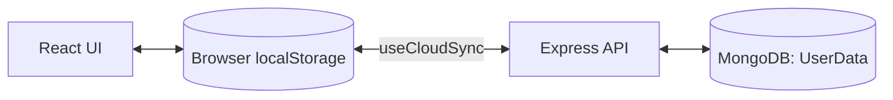
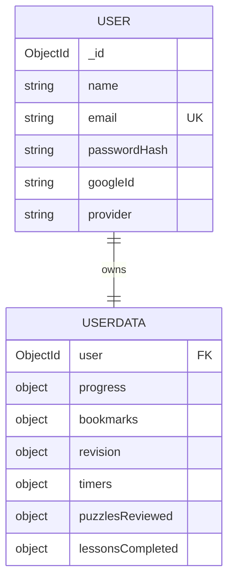
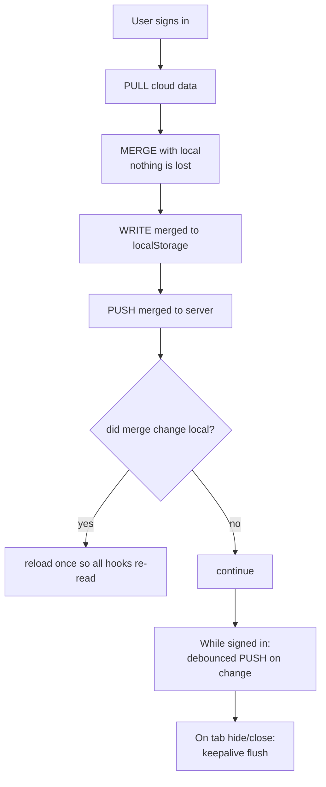
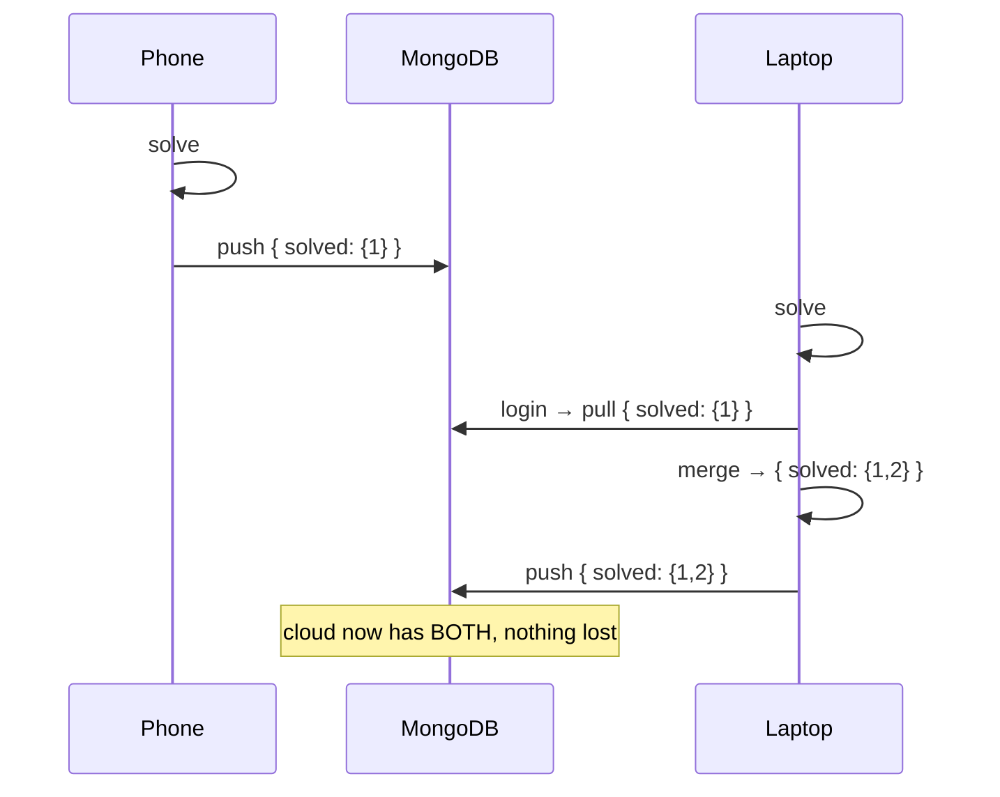

# 04 · Data Storage & The Sync Engine

> How MyDSA stores your progress, and how it stays consistent across devices without losing data.

---

## 1. Two tiers of storage



| Tier | What it holds | When it's used |
|------|---------------|----------------|
| **localStorage** | progress, bookmarks, revision, timers, puzzles, lessons | Always — even when logged out (offline-first) |
| **MongoDB `UserData`** | a mirror of the above, one document per user | Only for signed-in users; the durable source of truth across devices |

**Why offline-first? (interview)**
> "Learning tools should never feel blocked by the network. All reads/writes hit `localStorage`
> instantly. Sync is a background enhancement, not a dependency. A logged-out user gets a fully
> working app; logging in just makes progress portable."

---

## 2. The data model

**`User`** (identity) and **`UserData`** (progress) are kept **separate** — a classic 1:1 split.



**Why split identity from progress? (interview)**
> "Identity is small, security-sensitive, and read on every auth check. Progress is larger and
> written often. Separating them keeps auth queries lean, limits how much we load per request, and
> means a progress write never risks touching credentials."

**Why store progress as loose objects (maps) instead of arrays?**
> Progress is keyed by problem id: `{ [problemId]: { solved, solvedAt } }`. A map gives **O(1)**
> lookup/update for "is this solved?" and merges cleanly key-by-key. `minimize: false` in the schema
> keeps empty objects so the shape is stable.

**Server-side field allow-list (security):** the `PUT /api/data` route only accepts a fixed
`FIELDS` list and coerces types. The client owns the *shape*, but the server refuses unknown fields
— so a malicious client can't stuff arbitrary data into the document.

---

## 3. The sync engine (`useCloudSync`)

This is the heart of cross-device consistency. It does three jobs:



### 3a. On login — pull, merge, push

```js
const { data } = await api.getData();          // cloud
const local = readLocal();                     // this device
const { merged, changed } = mergeData(local, data);
writeLocal(merged);
await api.putData(merged);
if (changed) window.location.reload();          // let every hook re-read fresh state
```

**Why merge instead of "server wins" or "local wins"?**
> Imagine you solved problems on your phone (saved to cloud) and different ones on your laptop
> (only local). "Server wins" would erase the laptop's work; "local wins" would erase the phone's.
> **Merging the union** keeps *both*. This is a simple **conflict-resolution** strategy.

### 3b. Merge rules (in `lib/userData.js`)

- **Booleans / sets** (bookmarks, solved, puzzlesReviewed): **OR them** — if either side says true, it's true.
- **Counters** (revision `reviseCount`): **take the max** so re-syncs don't double-count.
- **Timestamps** (`solvedAt`, `lastRevised`): keep the **most recent**.
- **Timers**: keep the **larger** elapsed time.

This makes the merge **idempotent** — running it repeatedly gives the same result, which is exactly
what you want for a background sync that may run many times.

### 3c. While signed in — debounced push

```js
const poll = setInterval(maybePush, 2500);   // check for changes every 2.5s
// if changed → wait 1s of quiet, then PUT   (debounce)
```

**Why debounce? (interview)**
> "If we pushed on every keystroke or click we'd hammer the API. Debouncing waits for a short pause
> in activity, then sends one combined write. We also compare a snapshot to skip pushes when nothing
> actually changed — saving requests and battery."

### 3d. On tab close — keepalive flush

```js
api.putData(readLocal(), { keepalive: true });  // survives the page unloading
```

`keepalive` lets a final `fetch` complete even as the tab closes, so last-second changes aren't lost.

---

## 4. End-to-end example: solving a problem on two devices



---

## 5. Trade-offs & how we'd evolve it (interview)

| Current choice | Trade-off | Future improvement |
|----------------|-----------|--------------------|
| Whole-document `PUT` | Simple, but sends all data each sync | Field-level PATCH / diffs for large datasets |
| Poll every 2.5s | Easy, no infra | WebSockets / SSE for real-time multi-tab |
| Union merge | Never loses data | Per-field `updatedAt` for true last-write-wins |
| Client owns shape | Flexible | Stricter server validation / schema versioning |
| 1 doc per user | Fast reads | Split hot vs cold fields if it grows large |

**One-line summary for an interviewer:**
> "It's an **offline-first, last-write-wins-with-union-merge** sync: localStorage for instant UX,
> MongoDB as the durable store, and a debounced, idempotent merge engine that guarantees no progress
> is ever lost across devices."

Continue to **[05-system-design-concepts.md »](./05-system-design-concepts.md)**
