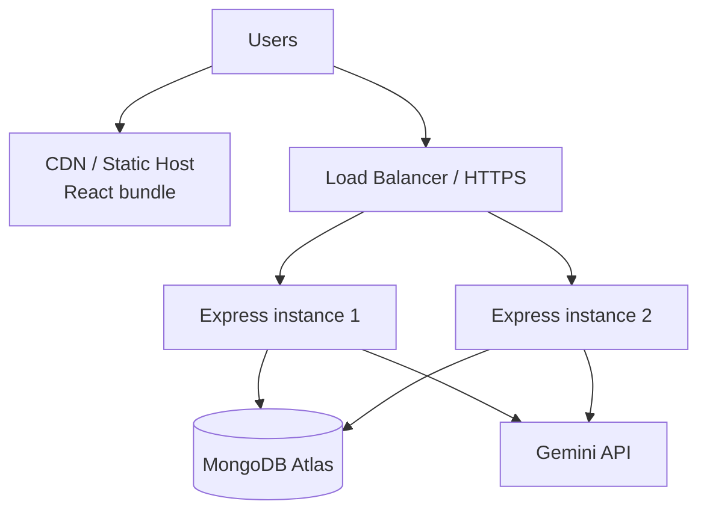
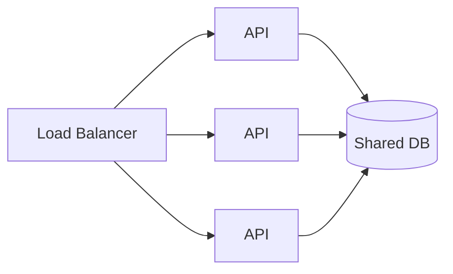
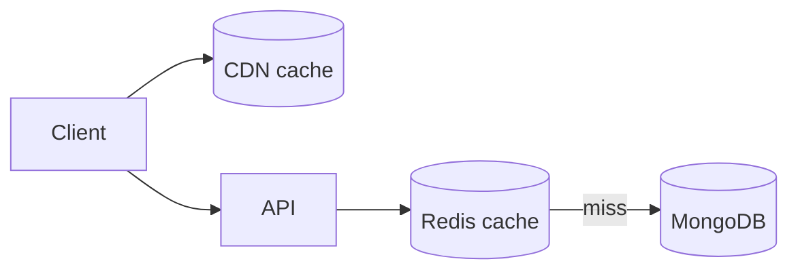
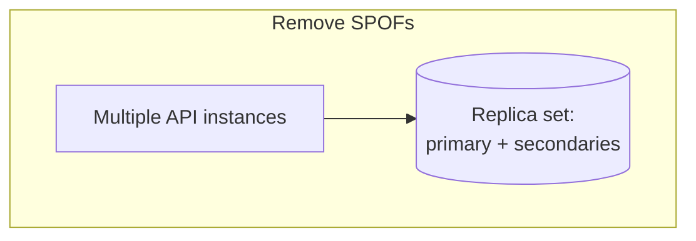
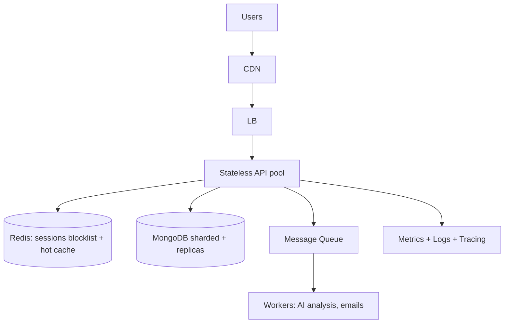

# 05 · System Design Concepts (using MyDSA as the example)

> This maps real system-design interview topics onto **this actual project**, then shows how you'd
> scale it. Concrete examples land far better in interviews than abstract theory.

---

## 1. The current architecture (single-region)

- **Static front end on a CDN** → cached near users, cheap, fast.
- **Stateless API** → can run many identical instances behind a load balancer.
- **Managed MongoDB (Atlas)** → durability, backups, replica sets handled for us.

---

## 2. Core concepts, each tied to MyDSA

### 2.1 Client-Server & REST
- **What:** the browser calls HTTP endpoints (`/api/auth/*`, `/api/data`) that return JSON.
- **In MyDSA:** verbs match intent — `POST /login` (create session), `GET /api/data` (read),
  `PUT /api/data` (replace). `PUT` is **idempotent**: sending it twice leaves the same state.

### 2.2 Statelessness & horizontal scaling
- **What:** the server keeps no per-user memory between requests.
- **Why it matters:** because auth is a self-verifying JWT, **any** API instance can serve **any**
  request. To handle more traffic you just add instances — no sticky sessions.

### 2.3 Caching (the biggest lever)
- **Browser/CDN cache:** the static bundle and images are cached with far-future headers; a new
  deploy uses new hashed filenames (**cache busting**).
- **In-app cache:** `TopicNotes` caches fetched markdown in memory so re-visiting a topic is instant.
- **Where we'd add more:** a **Redis** cache in front of MongoDB for hot reads.

**Cache trade-off (interview):** caching adds a **consistency** risk (stale data). We accept it for
static content (safe) but keep user progress uncached-or-short-TTL because it changes often.

### 2.4 Databases: SQL vs NoSQL
- **We chose NoSQL (MongoDB)** because progress is naturally a **nested JSON document** keyed by
  problem id. No joins needed; the document shape mirrors the client state 1:1.
- **When SQL would win:** if we added relational features like leaderboards with complex queries,
  transactions across users, or strong reporting — a relational DB or a hybrid would fit better.

### 2.5 Indexing
- `email` and `googleId` are **indexed** on `User`, and `user` is a unique index on `UserData`.
- **Why:** login looks users up by email on every attempt; an index turns an O(n) collection scan
  into an O(log n) lookup. The unique index also **enforces** one data doc per user at the DB level.

### 2.6 Rate limiting (protecting the system)
- Auth routes: 100 req / 15 min / IP. AI route: 20 / 15 min.
- **Why:** stops brute-force login and abuse of the (paid) Gemini endpoint. It's a basic
  **back-pressure** mechanism protecting both cost and availability.

### 2.7 Reliability & Single Points of Failure (SPOF)

- **API SPOF:** solved by running ≥2 instances behind a load balancer.
- **DB SPOF:** Atlas replica sets give automatic failover.
- **Third-party SPOF (Gemini):** the AI coach **degrades gracefully** — if the key is missing or the
  quota is hit, the app still shows the static interview banks and a friendly message instead of crashing.

**Graceful degradation is a great interview point:** *"A dependency being down should reduce
features, not take down the app."*

### 2.8 Security (defense in depth)
Summarized here, detailed in [doc 02](./02-authentication-and-authorization.md) & [doc 03](./03-cookies-and-sessions.md):
httpOnly + Secure + SameSite cookies, bcrypt hashing, server-side Google token verification,
credentialed CORS allow-list, per-user ownership scoping, rate limiting, and no secrets in the repo
(all via `.env`).

### 2.9 Observability
- Errors are logged server-side with tags (`[data:get]`, `[auth]`) for traceability.
- **Next step:** structured logs + metrics (request rate, error rate, latency) and alerting.

---

## 3. Estimation (back-of-the-envelope)

If MyDSA had **100k users**, each with a ~20 KB progress document:
- Storage ≈ 100k × 20 KB = **~2 GB** → trivial for MongoDB.
- If 10% are active daily and sync ~every 3s during a 30-min session:
  ≈ 10k × (1800/3) = **6M writes/day** ≈ **~70 writes/sec** average → single primary handles it,
  with debouncing keeping it far lower in practice.

**Why show math? (interview)** It proves you can size a system and spot the real bottleneck (here,
write volume — which our debounce + union-merge specifically reduces).

---

## 4. How MyDSA would evolve at scale

| Bottleneck | Fix |
|------------|-----|
| Sync write volume | Field-level diffs + queue writes |
| Slow AI calls blocking requests | Offload to a **message queue** + workers, return async |
| Read hotspots | Redis cache layer |
| Token revocation needed | Short-lived access + refresh tokens, Redis blocklist |
| Global latency | Multi-region CDN + read replicas |

Continue to **[06-interview-qa.md »](./06-interview-qa.md)**
