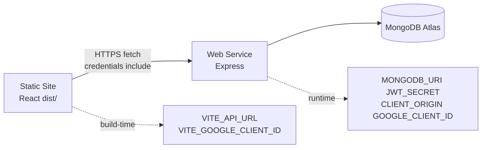

# 09 · Deployment & Environment Variables

> How MyDSA goes from laptop → GitHub → Render, which secrets live where, and the
> production bugs interviewers love asking about (SPA 404, origin_mismatch, cold starts).

---

## 1. Three places secrets can live

| Place | What goes there | Committed to Git? |
|-------|-----------------|-------------------|
| **Local `.env` / `server/.env`** | Dev values for your laptop | **No** (gitignored) |
| **GitHub** | Only `.env.example` placeholders | Yes — never real passwords |
| **Render Environment** | Production values for live site | No — set in dashboard |

**Interview one-liner:**
> "Secrets never ship in the repo. Locally we use gitignored `.env` files; in production
> Render injects the same keys at build/runtime. Vite `VITE_*` vars are baked in at **build**
> time; Express reads `process.env` at **runtime**."

---

## 2. Why two Render services?



| Service | Role | Build | Start |
|---------|------|-------|-------|
| **Static Site** | Frontend SPA | `npm install && npm run build` | *(static files)* |
| **Web Service** | API | `npm install` only | `npm start` |

**Common mistake:** putting `MONGODB_URI` / `JWT_SECRET` on the **Static Site**.  
Those are server secrets — the browser never needs them. The Static Site only needs `VITE_*`.

**Common mistake:** API Build Command = `npm run build`.  
The Express app has **no** `build` script → deploy fails with `Missing script: "build"`.

---

## 3. Exact env checklist

### Frontend (Static Site)

```text
VITE_API_URL=https://mydsa-api-sarvesh.onrender.com/api
VITE_GOOGLE_CLIENT_ID=xxxx.apps.googleusercontent.com
```

After changing `VITE_*` → **Clear build cache & deploy** (Vite embeds them at build).

### Backend (Web Service)

```text
MONGODB_URI=mongodb+srv://.../mydsa?...
JWT_SECRET=<long random>
NODE_ENV=production
CLIENT_ORIGIN=https://learn-dsa-201425.onrender.com
GOOGLE_CLIENT_ID=xxxx.apps.googleusercontent.com   # SAME as VITE_
# GEMINI_API_KEY= optional
```

`CLIENT_ORIGIN` must be the **exact** frontend origin (no trailing slash) so credentialed CORS works.

---

## 4. SPA rewrite — why `/login` 404'd

**Problem:** Refreshing `https://site.onrender.com/login` returned **404**, but `/` worked.

**Cause:** The static host looks for a real file `/login`. In an SPA only `index.html` exists;
React Router handles the path **in the browser**.

**Fix (Render Redirects/Rewrites):**

| Source | Destination | Action |
|--------|-------------|--------|
| `/*` | `/index.html` | **Rewrite** |

Also shipped as `public/_redirects`:

```text
/*    /index.html   200
```

**Interview answer:**
> "Deep links and refresh must rewrite to `index.html` with a 200. A 302 redirect would change
> the URL; a rewrite keeps `/login` in the address bar while serving the SPA shell."

---

## 5. Google `origin_mismatch`

**Error:** `Error 400: origin_mismatch`

**Cause:** The page origin (e.g. `https://learn-dsa-201425.onrender.com`) is not listed under
the OAuth client's **Authorized JavaScript origins**.

**Fix:** Google Cloud Console → Credentials → OAuth Web Client → add every origin you use
(`localhost:5173`, production URL). No trailing slash. `localhost` ≠ `127.0.0.1`.

---

## 6. Cookie / CORS in production

Frontend and API are **different hosts** → cross-site cookie:

- Cookie: `SameSite=None; Secure` when `NODE_ENV=production`
- Frontend fetch: `credentials: 'include'`
- API CORS: exact `CLIENT_ORIGIN`, `credentials: true` (not `*`)
- `app.set('trust proxy', 1)` so Express trusts Render’s HTTPS terminator

Bearer token in `localStorage` is the **fallback** when third-party cookies are blocked.

---

## 7. Free-tier cold start

First request after idle can take **30–50s** while Render wakes the Web Service.
`/api/health` eventually returns `{"ok":true}`.

**Interview angle:** mention health checks, retries on the client (`resolveSession` retries when a
token exists), and caching the last user so a blip doesn’t look like a logout.

---

## 8. Auth gate on the frontend

Public routes: `/`, `/login`, `/signup`.  
Everything else is wrapped in `RequireAuth` → guests go to `/login` with `state.from` so they
return after sign-in.

**Why both frontend gate + backend `requireAuth`?**
> "UI gating is UX. API gating is security. Never trust the client alone — anyone can call the API
> directly, so every sensitive route still verifies the JWT server-side."

---

## 9. Deploy order that works

1. Deploy API (env without `CLIENT_ORIGIN` if frontend URL not ready)
2. Deploy Static Site with `VITE_API_URL` pointing at API
3. Set API `CLIENT_ORIGIN` to frontend URL → redeploy API
4. Add frontend URL to Google JS origins
5. Add SPA rewrite on Static Site
6. Test `/api/health`, then `/login`, then a protected route logged out (must redirect)

Continue to **[06-interview-qa.md](./06-interview-qa.md)** for rapid-fire practice, or
**[07-problems-and-decisions.md](./07-problems-and-decisions.md)** for the war stories.
